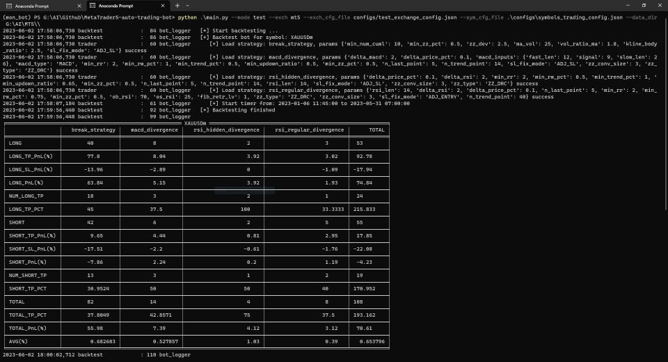

# Trading Bot using MetaTrader5 API

This repository contains a trading bot that utilizes the MetaTrader5 API for automated trading in the financial markets. The bot is designed to execute trades based on pre-defined strategies and market conditions.

## Table of Contents
- [Features](features)
- [Prerequisites](prerequisites)
- [Installation](#installation)
- [Configuration](#configuration)
- [Usage](#usage)
- [Disclaimer](#disclaimer)

## Features
  1. Multiple Strategies: You can configure and run multiple strategies simultaneously. Each strategy will be analyzed independently, and the bot will make trading decisions accordingly.
  2. Multiple Timeframes: The bot can analyze multiple timeframes simultaneously. By specifying different timeframes in the config file, the bot will gather data from those timeframes to make more informed trading decisions.
  3. Backtesting: You can backtest a strategy before running it live. The bot provides a backtesting module that allows you to test your strategies against historical data and evaluate their performance(using MT5 notebook to download historical data).
  4. Parameter Tuning: The bot provides flexibility in tuning strategy parameters. You can tuning the parameters to optimize your strategies based on market conditions and historical performance.
  5. Custom Strategy: The bot is designed to make it easy to add custom strategies. You can create your own strategy and adding it to the config file.

## Prerequisites
  Before using the trading bot, make sure you have the following:
  - MetaTrader 5 platform installed on your computer
  - Active trading account with a broker that supports MetaTrader 5
  - Basic knowledge of trading concepts and strategies

## Installation
  1. Clone the repository to your local machine:
     ```bash
     git clone https://github.com/Zsunflower/MetaTrader5-auto-trading-bot
  2. Install the required dependencies:
     ```bash
     pip install -r requirements.txt
  3. Install the TA-Lib library by following the installation guide provided on the [TA-Lib GitHub repository](https://github.com/TA-Lib/ta-lib-python).
## Configuration
  1. Log in to your MetaTrader 5 account using the MetaTrader 5 platform.
  2. Edit the 'configs/exchange_config.json' file and update the following:
     - account: Your MetaTrader 5 account number.
     - server: The server name for your MetaTrader 5 account.

## Usage
  1. Edit all strategies's parameters in 'configs/symbols_trading_config.json' file.
  2. Start the trading bot in live mode by running the following command:
     ```bash
     python main.py --mode live --exch mt5 --exch_cfg_file configs/exchange_config.json --sym_cfg_file configs/symbols_trading_config.json

  3. For backtesting a strategy, use the following command:
     ```bash
     python main.py --mode test --exch mt5 --exch_cfg_file configs/exchange_config.json --sym_cfg_file <configs/break_strategy_config.json> --data_dir <path to historical candle data>

   Backtest result of each strategy will be output like this:
    
    

   The bot will generate an HTML file that visualizes the generated orders in 'debug' folder. [View example](https://drive.google.com/drive/folders/1C0ZnOCIMQtW3uN2PjEis9MqDeLrSwVEm?usp=drive_link)
   
  4. For tuning a strategy's parameters, use the following command:
     ```bash
     python tuning.py --sym_cfg_file <tuning_configs/break_strategy_tuning_config.json> --data_dir <path to historical candle data>

## Disclaimer
  Trading in financial markets involves risks, and the trading bot provided in this project is for educational and informational purposes only. The use of this bot is at your own risk, and the developers cannot be held responsible for any financial losses incurred.
